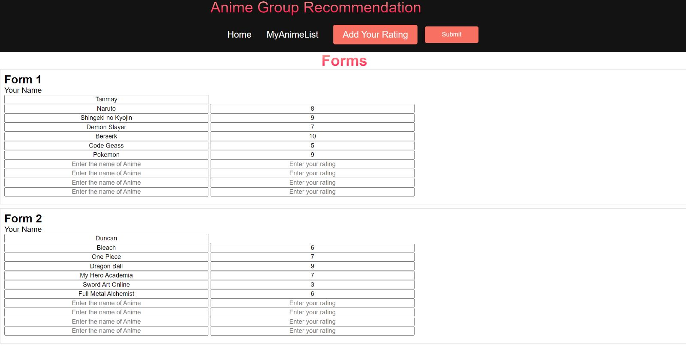
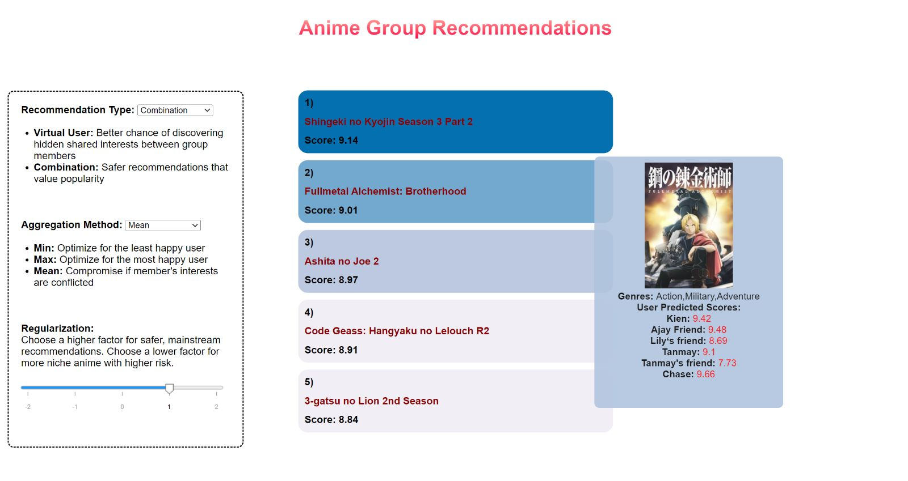

# TV Show Group Reccomendation System

## Introduction:
Anime are Japanese animated TV shows that are extremely popular around the world. Sometimes when trying to figure out what TV show to watch with a group of people, it is difficult to reconcile the preferences of everyone. This project applies machine learning modeling and big data visualization skills to figure out an effective method of selecting an anime everyone will enjoy! 

This project builds a system that can recommend anime to a group based on their past viewing history and the collective viewing history of a set of users. A dataset based on MyAnimeList (MAL), which includes different animes in MAL, which anime users have watched, and the users’ ratings.
 
Group Recommender use Flask as the back-end and Javascript especially D3 package to build the front-end and visualization. The recommender system is matrix-factorization (MF) based with modification to adopt group-specific behavior. You can read more about the MF appraoch in the MF section of the repo

https://user-images.githubusercontent.com/91752785/208131520-f3dec102-1fc9-49ec-a4ef-207f273e38ba.mp4

# Installation and Setup

**BEWARE: FIRST TIME INSTALLATION WILL DOWNLOAD A PRE-TRAINED MODEL (440MB)**

## On Linux/Mac OS
First, clone this repo and navigate to this directory in Terminal, then create a new virtual environment, you can use [conda](https://docs.anaconda.com/anaconda/install/index.html) using the shell script below, or any other software.

```bash
conda create -n group_rec python=3.9
conda activate group_rec
```

Next, install the required library:

```bash
cd application
pip install -r requirements.txt
```

Run the flask server:
```bash
python main.py
```

The application should be ready in the local host at port "5000". You can access it by open your browser and go to this url `http://127.0.0.1:5000`.

## On Windows
First, clone this repo and navigate to this directory in your command prompt, then create a new virtual environment, you can use [conda](https://docs.anaconda.com/anaconda/install/index.html) using the shell script below, or any other software.

```bash
conda create -n group_rec python=3.9
conda activate group_rec
```

Next, install the required library:

```bash
cd application
pip install -r requirements.txt
```

Run the flask server:
```bash
python main.py
```

The application should be ready in the local host at port "5000". You can access it by open your browser and go to this url `http://127.0.0.1:5000`.
# Execution

We decided to split our frontend into two separate sites, an input site (where users can input the data used to generate their recommendations) and an interactive visualization site (where users are able to see and interact with their recommended anime). 



*Figure 1: User rating input site*

For the input site, users are able to input their names followed by their anime ratings for up to 10 different anime. When all users have input their anime ratings, the users can press “submit” to submit their data. At this point their inputs are passed to the backend which takes the user inputs for the anime names and matches them to the closest anime name in our dataset using the FuzzyWuzzy Python library as their anime name inputs may not be the fully correct name. We took the highest match ratio from the user input and anime names in our database and converted the user anime name input to the one we had stored before. Now the user ratings and anime names are stored in a SQLite table which is used by the MF model to generate recommendations on these inputs. The backend then passes the results of the MF model as a JSON back to the front end which populates our second site, the interactive visualization page. 

Clicking the “Go to Visualization” button on this page sends them to the interactive visualization page, where users are able to see the top 5 recommendations for the group as well as the group and individual scores given to each recommended anime. Users are also able to see genres of the recommendations and a picture of the poster/title graphic (after all, an important part of deciding what anime to watch is the art-style) via a tooltip that shows when hovering over the recommendation. Another important feature of the visualization page is the selection pane on the left side, where users are able to alter the recommendation type, aggregation method, and regularization value used in the recommendation process. If they choose to alter parameters, the recommendations will populate in real time. 



Figure 2: Interactive recommendation visualization page
